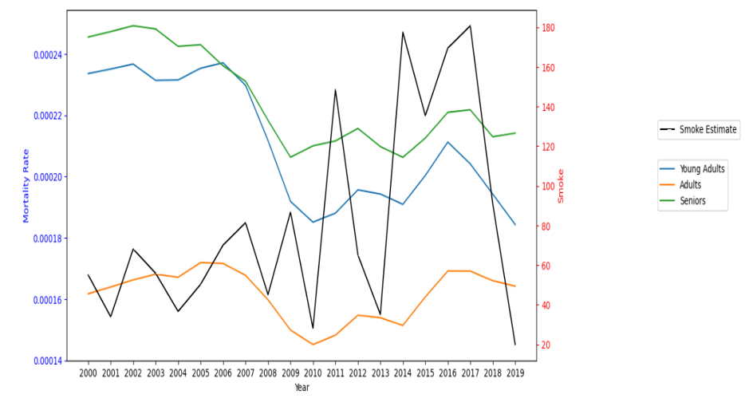

# Impact Analysis of Smoke Fires on Public Health and Safety

# Motivation 

The number of wildfires has been on the rise over the last few years and can have a huge impact on several aspects of a city. The number of fires have increased over the last few years and have a significant impact on the environment. Urban and rural landscapes are impacted in many ways. Urban landscapes suffer a more significant impact due to the density of people living in the city which affects both the quality of human lives and overall infrastructure. Beyond the impact of fires on an immediate level, they also have long term consequences on healthcare, environment, and economic aspects of a city. People living in the city may see an increase in respiratory issues, cardiovascular issues, and road accidents due to low visibility. Apart from their effect on health, fires also have repercussions on the economic conditions through property damage, disruption of businesses, agricultural losses, and tourism. The city council needs to have a proper plan to address all these concerns and make people aware of the measures that they have taken to overcome these losses.  There is also a need to see if a certain group of people are more vulnerable to this and introduce new measures to protect these individuals.

# Aim and Research Questions 

The goal of this submission of the project was to analyze the impact of wildfire on Derby, Kansas. The end goal is to be able to inform policy makers, city managers, city councils, or other civic institutions, to make an informed plan for how they could or whether they should make plans to mitigate future impacts from wildfires.

The project was divided into two halves where the first part of the project was focused on the smoke estimate calculation for Derby, Kansas and the second part was extending that analysis to see the impact of fires on Public Health and Safety. In the first part of the project, various techniques were explored such as Linear Regression, ARMA (Autoregressive Moving Average), ARIMA (Autoregressive Integrated Moving Average) models but ended up using SARIMA(Seasonal Autoregressive Integrated Moving Average (SARIMA)) for my forecasting model. This is because SARIMA explicitly incorporates seasonality into the model, which makes it a great fit for the time series data available to us. This helps in utilizing the recurring patterns at regular intervals to make more robust predictions. Also, SARIMA has a more flexible framework which can tune autoregressive and moving average components which allows the model to capture nonlinear patterns present in time series data.

The second phase of the project is the extension plan which focuses on the  impact of these fires on the health and safety of its residents mainly on the following aspects :

●	Respiratory Health Issues : Exposure to wildfire smoke can exacerbate respiratory conditions such as asthma, bronchitis, and chronic obstructive pulmonary disease (COPD)

●	Cardiovascular Effects : Fine particles in smoke can contribute to cardiovascular problems, potentially increasing the risk of heart attacks and other cardiovascular issues.

●	Visibility Reduction : Thick smoke can reduce visibility, posing hazards for drivers and increasing the risk of accidents on roads.

The analysis would revolve around answering the following questions around the impact of smoke fires on residents in Derby, Kansas - 

### Mortality Rates  for Respiratory Diseases, Cardiovascular Diseases and Road Accidents  

●	Possible correlations between increase in smoke fires and mortality rates because of the diseases

●	Which respiratory diseases are shown to have a significant increase  in mortality rates?

●	Observe trends in road accidents at the time of smoke fires due to low visibility.

### Demographic Disparity 

●	Identifying age groups or ethnicities most vulnerable or impacted by health conditions. 

●	Observe change in life expectancy across different demographics.

# Recommendations

The results provide insights into how smoke fires affect various aspects, including respiratory conditions, cardiovascular diseases, and reduced visibility leading to road accidents.

●	The county should implement necessary measures to address the rising mortality rates related to respiratory conditions among females especially for  Chronic obstructive pulmonary disease and Chronic respiratory diseases. This can be done through the following steps  : 

○	Launch targeted health education campaigns to raise awareness about the risks of respiratory conditions, emphasizing the importance of early detection, symptom recognition, and seeking medical attention.

○	Implement regular screening programs, especially for vulnerable populations, to detect respiratory conditions at an early stage. Early detection allows for timely intervention and better management of chronic diseases.

○	Improve access to healthcare services, ensuring that females have easy access to medical facilities, clinics, and specialists for respiratory health check-ups and treatment.

●	 Special attention is required for the AIAN ethnicity group where there has been an increase in mortality rates for respiratory and cardiovascular diseases. Life expectancy has also shown a visible decline for AIAN over the last few years.

○	Understand if the AIAN community is more involved in jobs that are more prone to health issues so that appropriate steps and strategies can be launched to address occupational health disparities.

○	Implement robust programs that can reform and enforce regulations in industries where the AIAN community is employed. Workers need to be educated on potential health hazards and provided with appropriate protective equipment.

○	Improve access to quality education by investing in schools and educational resources within or near AIAN communities. Enhance cultural competence in educational curricula to make them more inclusive.

○	Work with community leaders to act as liaisons between healthcare providers and community members to empower them with healthcare services, including preventive care, screenings, and chronic disease management which can foster trust and cultural understanding.

●	It is advisable to adjust driving guidelines, particularly during periods of increased smoke fires, to ensure road safety.

○	Launch public awareness campaigns to educate people about the risks associated with reduced visibility due to smoke fires. 

○	Utilize emergency alert systems to notify drivers of hazardous conditions caused by smoke fires.

○	Introduce variable speed limits that can be adjusted dynamically based on current visibility conditions.

# Folder Hierarchy

├── <b>Data/</b> 
&nbsp;&nbsp;&nbsp;├── Smoke_Estimate_Annual.csv 
&nbsp;&nbsp;&nbsp;├── aqi_yoy.csv 
&nbsp;&nbsp;&nbsp;├── aqi_gaseous.csv 
&nbsp;&nbsp;&nbsp;├── aqi_particulate.csv 
&nbsp;&nbsp;&nbsp;├── 1980_2014_percentage_change_diseases.CSV 
&nbsp;&nbsp;&nbsp;├── kansas_disease_mortality.CSV 
├── <b>Code/</b> 
&nbsp;&nbsp;&nbsp;├── Data_Extraction_Analysis.ipynb 
&nbsp;&nbsp;&nbsp;├── Project_Extension.ipynb 
&nbsp;&nbsp;&nbsp;├── Reader.py 
&nbsp;&nbsp;&nbsp;├── Wildfire_short_sample.json 
&nbsp;&nbsp;&nbsp;├── __init__.py 
&nbsp;&nbsp;&nbsp;├── test_geocalc.py 
&nbsp;&nbsp;&nbsp;├── extract_subset.py 
├── <b>Output/</b> 
&nbsp;&nbsp;&nbsp;├── Visualization_1.png 
&nbsp;&nbsp;&nbsp;├── Visualization_2.png 
&nbsp;&nbsp;&nbsp;├── Visualization_3.png 
&nbsp;&nbsp;&nbsp;├── Validation_Forecast.png 
&nbsp;&nbsp;&nbsp;├── Test_Forecast.png 
&nbsp;&nbsp;&nbsp;├── Test_Forecast_with_CI.png 
&nbsp;&nbsp;&nbsp;├── extension1_plot.png 
&nbsp;&nbsp;&nbsp;├── extension1_test.png 
&nbsp;&nbsp;&nbsp;├── extension2_plot1.png 
&nbsp;&nbsp;&nbsp;├── extension2_plot2.png 
&nbsp;&nbsp;&nbsp;├── extension2_test.png 
&nbsp;&nbsp;&nbsp;├── extension3_plot.png 
&nbsp;&nbsp;&nbsp;├── extension3_test.png 

# Description
Data : This folder contains input data files and intermediate data files created. 

Input Data Files -

USGS_Wildland_Fire_Combined_Dataset.json and USGS_Wildland_Fire_Merged_Dataset.json - Use the following [link](https://www.sciencebase.gov/catalog/item/61aa537dd34eb622f699df81) for downloading the GeoJSON Files.zip folder and store these two jsons into the Data Folder

1980_2014_percentage_change_diseases.CSV 

kansas_disease_mortality.CSV

There are other input data files which were greater than the size that can be uploaded. They can be downloaded from the following links and should be kept in the Data folder of the repository for reproducing the analysis :

CardioVascular Mortality Rates - [cardio both](https://drive.google.com/drive/folders/1BTdgQO9_5zHPr2ZgtVMGKHwdF7iP-oqL?usp=sharing)

Road Accident Mortality Rates - [accident both](https://drive.google.com/drive/folders/1XaMVcXKG6R_sH320fNXizFog5lxV9F4c?usp=sharing)

Life Expentancy - [Life Expectancy](https://drive.google.com/drive/folders/1I7MgU4m1tAxUkEePBA7y400QbwLf_E-M?usp=sharing)

Intermediate Data Files - 

Smoke_Estimate_Annual.csv - Smoke Estimate Data Aggregated for every year

aqi_yoy.csv - AQI calculated year over year

aqi_particulate.csv

aqi_gaseous.csv

Output : This folder contains several visualizations from the first and second phase of the project like Smoke Estimates and AQI data aggregated over years and mortality rates for different diseases respectively

Report: This folder contains reports and presentations from the different phases of the project

Code : This folder contains the two main code files in the form of Jupyter notebook and supporting code which was used for data acquisition.

LICENSE : A file that contains an MIT LICENSE

README.md : A file that contains important information about the project and steps that makes the analysis reproducible

# Prerequisites
Before using this code, ensure you have the following prerequisites installed:

1.) Python 3

2.) Requests

3.) Pandas

# Data Sources and Description

USGS_Wildland_Fire_Combined_Dataset.json: This contains the Combined wildland fire datasets for the United States and certain territories [Link](https://www.sciencebase.gov/catalog/item/61aa537dd34eb622f699df81) 

The USGS data contains the combined wild fire datasets for the United States and certain territories. The data has been collected by the US Geological Survey and is well documented. The data is available in a few formats and the analysis has been conducted using the GeoJSON format.

US City assigned for individual analysis -  [Google spreadsheet](https://docs.google.com/spreadsheets/d/1cmTW5fgU3KyH6JbrRao-qWjzu2GovKk_BkA7a-poGFw/edit)

The city under consideration for my analysis is Derby, Kansas with coordinates (37.552407, -97.261492)

[Chronic Respiratory Disease Mortality Rates by County](https://ghdx.healthdata.org/record/ihme-data/united-states-chronic-respiratory-disease-mortality-rates-county-1980-2014)

The data contains Mortality rates for different counties in Kansas with their FIPS between the time period 1980 - 2014.  Mortality rates for different counties in Kansas where mortality rate is deaths per 100,000 population.

 FIPS - The Federal Information Processing Standards (FIPS) code, a unique identifier for states and counties in the United States
 
Data is available for the following respiratory conditions -

●	Chronic respiratory diseases

●	Chronic obstructive pulmonary 

●	Pneumoconiosis

●	Silicosis

●	Asbestosis

●	Coal workers pneumoconiosis

●	Other pneumoconiosis

●	Asthma

●	Interstitial lung disease

●	Other chronic respiratory 

[Mortality Rates by Causes of Death and Life Expectancy by County, Race, and Ethnicity](https://ghdx.healthdata.org/record/ihme-data/united-states-causes-death-life-expectancy-by-county-race-ethnicity-2000-2019)

 
This data source helps address the first question which focuses on finding a correlation between smoke fires and overall mortality rates due to respiratory conditions. The analysis would further review if there are certain respiratory diseases which have seen a major increase as compared to others and how their correlation is with increase in smoke fires.This data contains a detailed view of the mortality rates due to respiratory conditions, cardiovascular health and road accidents with columns such as Location, FIPS, Race, Sex, Age group, Cause of death between the time period 2000-2019. The estimates are given in the following three columns :  

Val - Estimate for that specific county

Lower - 2.5% percentile estimate

Upper - 97.5% percentile estimate 

The data also contains life expectancy by different demographic to validate the change in mortality rates 

This data source will help find patterns across different demographics to identify highly prone risk groups who are being affected the most. The analysis would initially be done at a univariate level for each demographic data such as race, sex and age.

# Licenses and Reference Code

This project is licensed under the MIT License. The sample codes shared for reference have been provided under the [Creative Commons CC-BY license](https://creativecommons.org/licenses/by/4.0/):

[Sample Code for GeoJSON reader](https://drive.google.com/file/d/1TwCkvdaw0MxJzW7NSDg6XxYQ0dvaS44I/view)

[Sample Code for Distance Computation](https://drive.google.com/file/d/1qNI6hji8CvDeBsnLDAhJXvaqf2gcg8UV/view)

[Sample Code for fetching data from US EPA Air Quality System API](https://drive.google.com/file/d/1bxl9qrb_52RocKNGfbZ5znHVqFDMkUzf/view)

# Reproducibility

The following steps need to followed to run this code seamlessly :

&emsp; Clone this repository to your local machine. 

&emsp; Install all the required libraries. 

&emsp; Download the jsons - USGS_Wildland_Fire_Combined_Dataset.json and USGS_Wildland_Fire_Merged_Dataset.json from  the following [link](https://www.sciencebase.gov/catalog/item/61aa537dd34eb622f699df81) by downloading the GeoJSON Files.zip folder and store these two jsons into the Data Folder 

&emsp; Run Data_Extraction_Analysis.ipynb to generate all Visualizations and output csv file stored in Data Folder 

&emsp; Download the input data files required for the second phase of the project which is the extension plan by downloading the folders from the links mentioned in the data section above and store these folders in the Data Folder of the repository 

&emsp; Run Project_Extension.ipynb to view all the results from the second phase of project which focuses on the impact of smoke fires on public health and safety.  

# Considerations for Analysis and Reproducibility

&emsp; The input data file needs to be downloaded from the link mentioned under Data Sources and should be kept in the Data Folder for successful Execution of the Python Code 

&emsp; The Json Files created in the code are not present under the Data Folder due to its large size and hence need to be stored in the data folder before running the code 

&emsp; The distance threshold from the city assigned has been kept at 1250 miles for the time period between 1963 - 2023 

&emsp; The data fetched for my city(Derby, Kansas) had data for the time period for the time period between 1963 - 2020 and data was found to be missing post 2020 

&emsp; The data is not well distributed and hence fires over the entire year have been considered instead of the fires between 1st May to 31st October. 

&emsp; A modified version of ARIMA called SARIMA has been used in forecasting the Smoke Estimate for the next 25 years (2024-2049) along with confidence intervals for thos predictions  

# Output

Visualization 1 : Produce a histogram showing the number of fires occurring every 50 mile distance from your assigned city up to the max specified distance.

Visualization 2 : Produce a time series graph of total acres burned per year for the fires occurring in the specified distance from your city.

Visualization 3 : Produce a time series graph containing your fire smoke estimate for your city and the AQI estimate for your city.

Validation Forecast : Created a Validation Set to select the best and optimized parameters for the SARIMA Model

Test Forecast : Used the Trained Model to make predictions for the 2024 - 2049 period

Test Forecast with CI: Created a plot with Confidence Intervals for the prediction on 2024 - 2049 period

Mortality Rates for Respiratory Conditions between Males and Females

Correlation Test for Mortality Rates of females due Respiratory Conditions and Smoke Estimate

Mortality Rates for different ethnicities for Cardiovascular Diseases

Life Expectancy for different ethnicities for Cardiovascular Diseases

ANOVA results 

Mortality Rate for Road Accidents of different Age Groups over the years

Correlation results for Road Accident and Smoke Estimate

# Documentation Practices

PEP 8 – Style Guide for Python Code

Modular code with intuitive function names for easy understanding

Inline comments and Markdown provided for all notebooks

# License

This assignment code is released under the MIT License.
